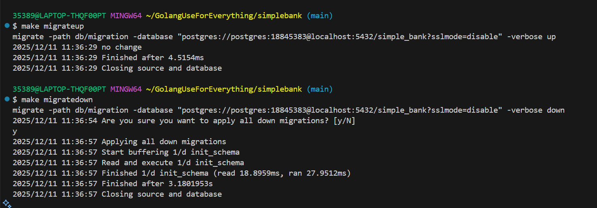
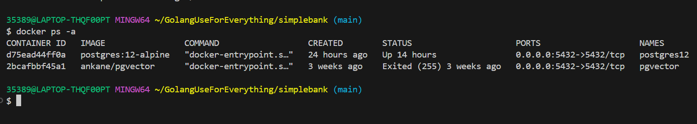
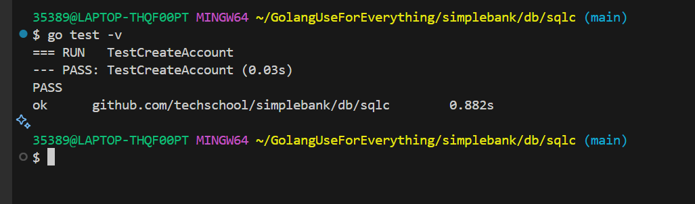

# Golang Use for Everything Project

Welcome to my Go learning project!  
This repository contains small Go programs, examples, and exercises I’ve created while learning the language.

## About This Project
This project is designed to help me practice and understand core Go concepts such as:

- Variables & Data Types  
- Functions  
- Structs & Methods  
- Interfaces  
- Packages & Modules  
- Error Handling  
- Concurrency (goroutines & channels)

##  Project to make the migration run for the DataBase.

Postgres container normally creates a postgres user

- migrate -path db/migration -database




Use a yaml file  

``` bash

version: "1"
packages:
  - name: "db"
    path: "./db/sqlc"
    queries: "./db/query/"
    schema: "./db/migration/"
    engine: "postgresql"
    emit_json_tags: true
    emit_prepared_queries: true
    emit_interface: false
    emit_exact_table_names: false


```


## Restart Docker container and Run your migrations on the same database and Container. 

```bash 
docker stop postgres12
docker start postgres12

```




## connecting migration with postgres to the  Docker container.


## Uni Testing with database Postgres and Docker container.


